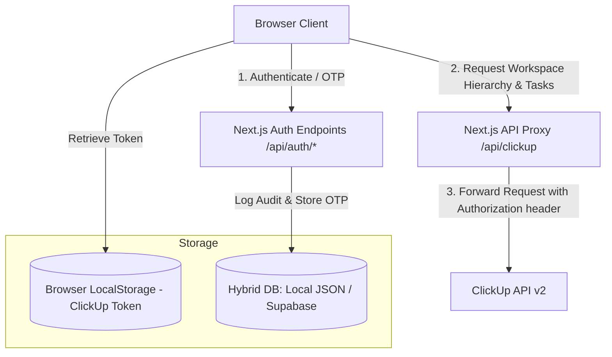

# TM Labs — Product Operations Dashboard
## Codebase & Architectural Documentation

Welcome to the technical documentation for the **TM Labs Product Operations Dashboard**. This dashboard serves as an executive-level tracking and reporting interface, pulling real-time operations data from ClickUp to visualize delivery speed, project health, blocker tracking, and team workload.

---

## Table of Contents
1. [System Overview & Architecture](#1-system-overview--architecture)
2. [Domain Layer & Directory Structure (FSD)](#2-domain-layer--directory-structure-fsd)
3. [Authentication, OTP, & Middleware](#3-authentication-otp--middleware)
4. [Session Audit Logging & Hybrid Database](#4-session-audit-logging--hybrid-database)
5. [Data Fetching & ClickUp API Integration](#5-data-fetching--clickup-api-integration)
6. [Design System & Styling Token Architecture](#6-design-system--styling-token-architecture)
7. [Dashboard Pages & Key Features](#7-dashboard-pages--key-features)
8. [Reporting Center & Dynamic Excel Export](#8-reporting-center--dynamic-excel-export)
9. [Development, Configuration, & Environment Variables](#9-development-configuration--environment-variables)

---

## 1. System Overview & Architecture

The application is built on **Next.js 14/15** (using the React App Router) and runs entirely in a **Serverless/Edge-compatible** configuration. 



### Core Architecture Design Pillars
* **Direct Client-to-ClickUp Context**: Task data is fetched directly from ClickUp. No task information or private customer data is persisted on any database server.
* **API Token Privacy**: The user's ClickUp Personal API Token is stored only in the browser's `localStorage` (`clickup_token`) and is never saved permanently by TM Labs servers.
* **Server-side Routing Proxy**: An API proxy endpoint (`/api/clickup`) handles outgoing calls to ClickUp v2 APIs. This helps prevent CORS issues and can inject a server-side `CLICKUP_API_TOKEN` if defined.
* **HMAC Sessions**: Sessions are verified using light-weight JSON-web-token equivalents, signed and checked natively using the browser/edge-compatible Web Crypto API.

---

## 2. Domain Layer & Directory Structure (FSD)

The codebase strictly follows a **Modified Feature-Sliced Design (FSD)** pattern combined with principles of **Domain-Driven Design (DDD)**. This architecture ensures high modularity, clean boundaries, and clear separation of concerns.

```
tmlabs-task-tracker/
├── app/                  # NEXT.JS ROUTING & COMPOSITION LAYER
│   ├── api/              # API Route Handlers (Auth, ClickUp proxy)
│   ├── design-system/    # Page route wrapper for Design System Showcase
│   ├── docs/             # Page route wrapper for Architecture Docs
│   ├── login/            # Login screen (OTP Input UI)
│   ├── projects/         # Project Health overview
│   ├── reporting/        # Weekly/Monthly/Quarterly report downloads
│   ├── team/             # Team performance and workload metrics
│   ├── globals.css       # Next.js global styling rules
│   ├── layout.tsx        # App wrapper (injects Context Providers)
│   └── page.tsx          # Main Executive Overview Page
├── db/                   # Database folder for mock development database
│   └── db.json           # Local fallback JSON database
├── docs/                 # General architectural markdown documentation
├── features/             # STANDALONE DOMAIN LAYER (Business Features)
│   ├── design-system/    # Interactive token showcase
│   ├── docs/             # In-app architecture page
│   └── home/             # Home view hook abstractions
├── public/               # Public assets (Icons, Logos, Images)
├── shared/               # INFRASTRUCTURE LAYER (Reusable Atoms & Config)
│   ├── api/              # ClickUp Client Wrapper (clickup.ts)
│   ├── components/       # Core UI (cards, charts, layouts, tables, modals)
│   ├── context/          # React Global State providers (ClickUp, Filters)
│   ├── hooks/            # Shared React Hooks (useFilteredTasks.ts)
│   ├── styles/           # 3-Layer Design System CSS variables
│   └── utils/            # Helpers (JWT-HMAC session, Db Client, Excel, User Mapping)
├── next.config.ts        # Next.js build-time configuration
├── proxy.ts              # Authentication Middleware logic
└── package.json          # Node dependencies and build scripts
```

### Isolation Rules
1. **Composition Layer (`app/`)**: Routes should contain minimal logic. They must import views or pages from `features/` or `shared/` to compose layout and views.
2. **Domain Layer (`features/`)**: Standalone business modules. Features are prohibited from importing directly from other features to prevent high coupling.
3. **Infrastructure Layer (`shared/`)**: Contains building blocks used by multiple features (e.g., standard layout templates, form inputs, styling primitive variables).

---

## 3. Authentication, OTP, & Middleware

Access to the TM Labs dashboard is protected using a passwordless, email-based **One-Time Passcode (OTP)** verification flow.

### Authentication Flow
1. **Domain Restriction**: Access is strictly limited to emails matching the `takeoutmedia.xyz` and `tmlabs.xyz` domains.
2. **OTP Generation**: A random 6-digit passcode is generated and saved in the database with a 5-minute expiration period.
3. **SMTP Delivery & Dev Fallback**:
   * If SMTP environment variables are fully configured, the application sends a styled security email to the user using `nodemailer`.
   * **Developer Mode**: If SMTP variables are missing or use default placeholders, the backend switches to *Mock Mode*. It logs the OTP to the Node console and returns the OTP in the JSON API response, allowing the front-end login page to display the code in the UI for effortless local testing.
4. **Session Cryptography**:
   * Upon verifying the OTP, the server generates an HMAC-SHA256 session token signed with `JWT_SECRET`.
   * Verification utilizes the Web Crypto API (`crypto.subtle`) for high compatibility on serverless edge functions.
   * The token format is a two-part dot-separated string: `[base64urlEncodedPayload].[base64urlEncodedSignature]`.
   * The token is returned inside an HTTP-Only, secure cookie called `session_token` with a 7-day expiration time.

### Authentication Middleware (`proxy.ts`)
* Next.js utilizes `middleware.ts` to intercept requests. In this codebase, the middleware logic is stored in [proxy.ts](file:///c:/Users/idyur/OneDrive/Documents/Desktop/Projects/tmlabs-task-tracker/proxy.ts).
* **Route Rules**:
  * Unprotected routes (like `/login`, `/api/auth/*`, and static files) are passed through.
  * Verified sessions attempting to view `/login` are automatically redirected to the home page (`/`).
  * Any unauthenticated requests to protected API endpoints return a `401 Unauthorized` JSON message, while frontend pages redirect the browser to `/login`.
* > [!IMPORTANT]
  > Because Next.js automatically executes middleware ONLY when defined in `middleware.ts` at the root, if this file is not copied or symlinked from `proxy.ts`, middleware protection will not be active. Ensure `proxy.ts` is copied or imported in `middleware.ts` in production configurations.

---

## 4. Session Audit Logging & Hybrid Database

To keep track of dashboard usage, active sessions log their details (email, login timestamps, and logout timestamps) to an audit db.

```
       +------------------------------------+
       |   Hybrid Database Layer (db.ts)    |
       +-----------------+------------------+
                         |
             isSupabaseConfigured()?
             /                    \
           YES                     NO
           /                         \
  +-------v-------+          +--------v--------+
  | Supabase REST |          |   db/db.json    |
  |  (Production) |          |  (Development)  |
  +---------------+          +-----------------+
```

### Hybrid Database Engine
The database file [db.ts](file:///c:/Users/idyur/OneDrive/Documents/Desktop/Projects/tmlabs-task-tracker/shared/utils/db.ts) acts as an orchestrator, adapting dynamically between local and production environments:

* **Production (Supabase)**: When `SUPABASE_URL` and `SUPABASE_SERVICE_ROLE_KEY` are configured, the API sends HTTP REST queries to Supabase. It maintains two tables:
  * `otps`: Records current sign-in codes (`email`, `code`, `expires_at`).
  * `logs`: Records user login history (`id`, `email`, `login_time`, `logout_time`).
* **Development (Local JSON)**: If Supabase values are not specified, it defaults to a local mock database. It reads and writes database records in [db/db.json](file:///c:/Users/idyur/OneDrive/Documents/Desktop/Projects/tmlabs-task-tracker/db/db.json).
  * **Atomic Write Protection**: To prevent file corruption during simultaneous edits, writing to `db.json` creates a temporary file `db.json.tmp` and renames it atomically once written (`fs.rename`), preventing data corruption.

---

## 5. Data Fetching & ClickUp API Integration

The data displayed on the dashboard comes from the ClickUp API v2.

### Routing ClickUp Traffic
All front-end calls are handled in [clickup.ts](file:///c:/Users/idyur/OneDrive/Documents/Desktop/Projects/tmlabs-task-tracker/shared/api/clickup.ts) which routes requests to `/api/clickup`. This API handler acts as a proxy, appending the Authorization token (`clickup_token` retrieved from localStorage) and querying ClickUp's endpoints:

1. **Workspaces (`/team`)**: Fetches available ClickUp teams associated with the API key.
2. **Members (`/team/{team_id}/member`)**: Fetches active team members.
3. **Task List (`/team/{team_id}/task`)**: Fetches all tasks across the workspace. It supports pagination, reading up to 100 tasks per page and stopping once the API returns a smaller set, with a safety loop cap of 50 pages.
4. **Spaces Hierarchy (`/team/{team_id}/space`)**: Crawls spaces, then requests folders (`/space/{space_id}/folder`) and folderless lists (`/space/{space_id}/list`) in parallel to build the project sidebar tree.

### Data Normalization & Flag Calculations
Once raw task objects return from ClickUp, they are parsed and augmented with status metrics in [ClickUpContext.tsx](file:///c:/Users/idyur/OneDrive/Documents/Desktop/Projects/tmlabs-task-tracker/shared/context/ClickUpContext.tsx):

* **Overdue Tasks**: Task is incomplete and its `dueDate` falls before current time.
* **Blocked Tasks**: Task status contains the word `blocked`.
* **Spillover Tasks**: Task is incomplete, overdue, and was scheduled to finish in the last 7 days (indicating a spillover from the previous sprint/week).
* **Deduplication**: Tasks are run through a deduplication helper (`uniqueTasksMap.set(task.id, task)`) to prevent listing duplicates when queries overlap.
* **Auto-Sync**: When configured, the workspace data re-fetches from ClickUp every 60 seconds automatically.

---

## 6. Design System & Styling Token Architecture

The dashboard uses a structured **3-Layer CSS Token System** built using vanilla CSS variables.

```
+-----------------------------------------------------------+
| 1. PRIMITIVES (shared/styles/colors.css)                  |
|    - Raw hex color values (--color-brand-pink: #FF3396)   |
+-----------------------------------------------------------+
                             |
                             v
+-----------------------------------------------------------+
| 2. SEMANTICS (shared/styles/semantics.css)                |
|    - Contextual aliases mapping to primitives             |
|    - (--bg-primary: var(--color-slate-900))               |
|    - Dark mode constants (always-on)                      |
+-----------------------------------------------------------+
                             |
                             v
+-----------------------------------------------------------+
| 3. COMPONENT STYLES (shared/styles/*.css)                 |
|    - Consumes semantics variables for typography, buttons |
+-----------------------------------------------------------+
```

### Visual Assets & Theme Constants
* **Brand Styling**: Features vibrant colors, neon gradients (pink `#FF3396` to purple `#6633FF`), glassmorphism cards (`backdrop-blur-xl bg-card/80`), and clear status indicators.
* **Interactive Design Showcase**: Running `/design-system` renders an interactive visual manual.
  * **Server-side CSS Variable Parser**: The showcase page uses [design-tokens.ts](file:///c:/Users/idyur/OneDrive/Documents/Desktop/Projects/tmlabs-task-tracker/shared/utils/design-tokens.ts) inside a React Server Component (RSC) to parse color variables, semantic classes, spacing numbers, and typography definitions directly from the CSS stylesheet files via Node filesystem reads (`fs.readFileSync`), making the showcase automatically stay up-to-date with style changes.

---

## 7. Dashboard Pages & Key Features

The application is structured into four main workspace modules accessible via the navigation sidebar:

### 1. Executive Overview (`/`)
* **KPI Metrics**: Displays 8 card metrics (Total Tasks, Weekly Completed, Monthly Completed, In Progress, Blocked, Spillover, High Priority, and Active Projects).
* **ClickUp Status Breakdown**: Grouped list widgets summarizing tasks in Backlog, In Progress, In Review, and Completed states. Clicking any status opens a filtered slide-out tasks grid.
* **Interactive Analytics Charts**: Implements Recharts graphs plotting priority distribution (Donut chart), weekly trends (Line chart), team workloads (Bar chart), and project progress bars.

### 2. Reporting Center (`/reporting`)
* **Interactive Period selection**: Filter dashboard values by Weekly, Monthly, Quarterly, and All Time periods. Includes offset paginators to view past or future ranges.
* **Delivery Metrics Grid**: Metrics summary of completed tasks, blockers, and delayed tasks within the chosen interval.

### 3. Team Performance (`/team`)
* **Workload Comparison Chart**: Bar chart illustrating the number of tasks assigned to each developer.
* **Team Workload Breakdown Grid**: Cards for each member showing their active task count, completed items, and overdue count. Clicking a member filters the dashboard view for their tasks.
* **Deactivated User Mapping**: In ClickUp workspace migrations, accounts might be deactivated. The application uses [userMapping.ts](file:///c:/Users/idyur/OneDrive/Documents/Desktop/Projects/tmlabs-task-tracker/shared/utils/userMapping.ts) to transparently redirect task assignments from old user IDs/emails to active accounts (e.g., merging old El-Roy Wisdom and John Uguru accounts into their new active profiles).

### 4. Project Health (`/projects`)
* **Project Inventory**: Lists active ClickUp lists with overall progress bars.
* **Risk Categorization**: Calculates project health:
  * **On Track**: Combined late and spillover tasks are under 10% of total tasks.
  * **At Risk**: Combined late and spillover tasks represent 10% to 30% of total tasks.
  * **Delayed**: Combined late and spillover tasks exceed 30% of total tasks.
* **Gantt Chart Timeline**: Clicking a project opens its detail panel, showing a custom CSS Gantt chart that renders horizontal task timelines from start date to due date, alongside a parent-subtask tree view.

---

## 8. Reporting Center & Dynamic Excel Export

The spreadsheet download system generates highly detailed reports directly in the browser.

### Styling & Layout Details
* Generated via [excelReport.ts](file:///c:/Users/idyur/OneDrive/Documents/Desktop/Projects/tmlabs-task-tracker/shared/utils/excelReport.ts) using `exceljs`.
* Spreadsheet rows use a dark navy theme header (`#10024F`) and a bright pink divider (`#FF3396`), aligning with TM Labs' branding.
* Includes task detail cells, priority badges, due dates, statuses, and a bottom summary table for task totals (Done, In Progress, Spilled, Pending).
* **Day-by-Day Activity Tracker**: Generates Mon-Fri calendar cells filled with a pink checkmark (`✓`) for any tasks active or completed on those days.

### Client-Side Chart Injection
Because Microsoft Excel does not natively export charts generated via standard JavaScript library components, the system uses a custom canvas drawing engine:

```
[Generate Excel Report]
         |
         v
[Initialize Offscreen Canvas]
         |
         v
[Draw Clustered Bar Chart using HTML5 Canvas API]
(Paints backgrounds, axes, gridlines, legends, rotated labels, and data bars)
         |
         v
[Convert Canvas to Base64 PNG data URL]
         |
         v
[Insert Image into Excel Worksheet via exceljs]
         |
         v
[Download styled spreadsheet using FileSaver]
```

This ensures the downloaded spreadsheet includes a high-resolution, branded workload chart out of the box, without requiring any external chart rendering API.

---

## 9. Development, Configuration, & Environment Variables

### Environment Variables
Configure the application by creating a `.env.local` file in the root directory:

```bash
# JWT Secret for Session Hashing (HMAC key)
JWT_SECRET=your-secure-random-key-32-chars-long

# ClickUp API Credentials (Optional server fallback token)
CLICKUP_API_TOKEN=pk_...

# SMTP Configuration (For sending login OTPs via email)
SMTP_HOST=smtp.yourprovider.com
SMTP_PORT=587
SMTP_USER=your-smtp-username
SMTP_PASS=your-smtp-password
SMTP_FROM="TM Labs Dashboard <no-reply@tmlabs.xyz>"

# Supabase Configurations (Optional - production persistence)
SUPABASE_URL=https://your-project.supabase.co
SUPABASE_SERVICE_ROLE_KEY=your-supabase-service-role-key
```

### Database Table Schemas
To set up production logging in Supabase, create the following tables:

```sql
-- OTP validation table
CREATE TABLE public.otps (
    email text PRIMARY KEY,
    code text NOT NULL,
    expires_at bigint NOT NULL
);

-- Session audit log table
CREATE TABLE public.logs (
    id uuid PRIMARY KEY,
    email text NOT NULL,
    login_time timestamp with time zone NOT NULL,
    logout_time timestamp with time zone
);
```
